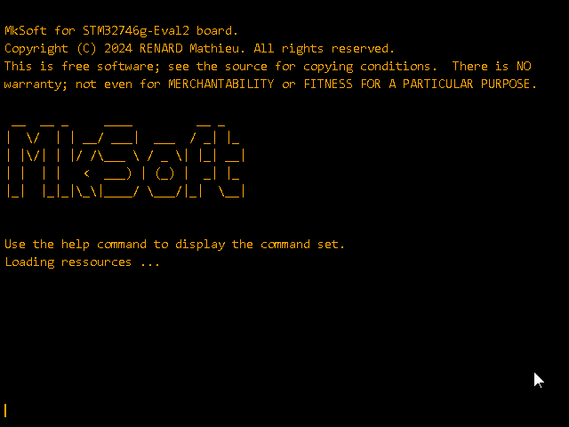
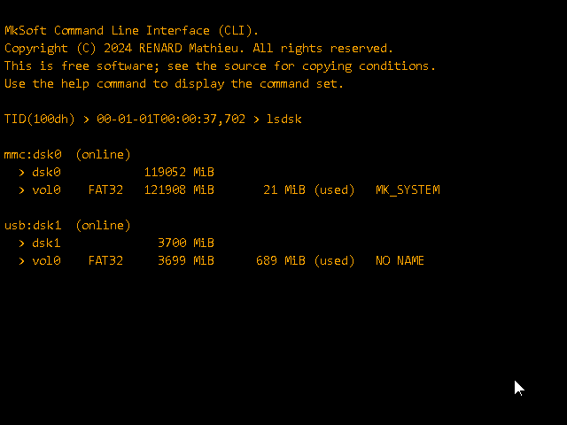
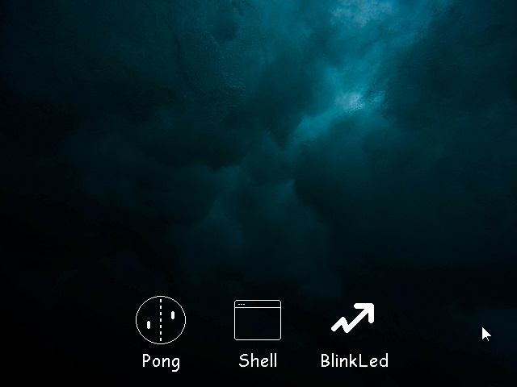
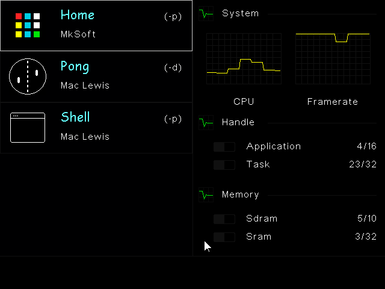
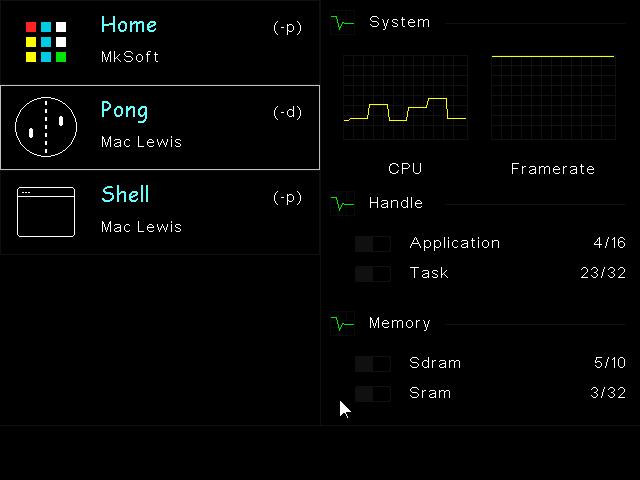
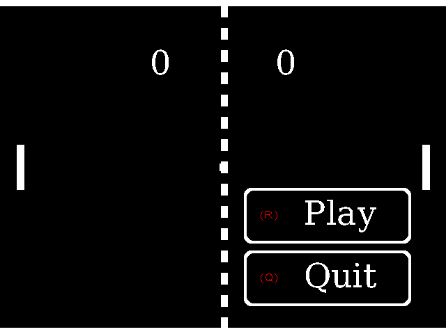

# Mk Software

**Mk** is a tiny operating system designed to run on the **STM32F746g-Eval2** 
board.
**Mk** has been designed from scratch. It provides a software ecosystem that 
can be integrated with the **STM32F75xxx** and **STM32F74xxx** MCU family.

## Application Programming Interface (API)

The API provided by **Mk** is still under development, but already offers the 
following features:

 - a multi-tasking system with rights management (Thread Vs Handler Mode),
 - a dynamic loader for loading external applications,
 - a built-in shell for native or external command execution,
 - a graphical engine supporting the execution of static or dynamic applications 
   through painting or listening functions,
 - a set of graphic methods for drawing primitives (rectangle, circle, etc.), 
   unicode character strings (ASCII, UTF8, UTF16 or UTF32) and images 
   (BMP 24 and 32 bits),
 - a font manager for adding new fonts at runtime. Native fonts are embedded in 
   non-volatile memory (FLASH or QSPI). New fonts can be integrated and 
   referenced at runtime and are embedded in RAM memory,
 - an event management system that supports mouse, keyboard, joystick and so on 
   (HID devices, GPIO triggers, Application event, ...),
 - a multi-tasking USB stack. Only the HUB, HID and MSC device classes 
   are currently supported, but new classes can easily be added,
 - a multi-tasking file system that supports SD/MMC or MSC devices (USB Key, ...
   ), multi-partition and concurrent access,
 - a synchronous and asynchronous function execution system,
 - a critical error (exception) management system with error reporting.
 
To eliminate the risk of memory fragmentation, no dynamic allocation of variable 
size is performed by the system. The kernel provides a set of functions for 
fixed-size allocations called **memory pool**.

## Trusted Execution Environment (TEE)   

The multi-tasking kernel was developed to provide a trusted execution 
environment (TEE) for the user:

- **privileged or handler mode** : this execution mode has full rights and can 
  be used to manipulate the system's protected memory.
- **unprivileged or thread mode** : this execution mode has restricted rights 
  and cannot manipulate the system's protected memory. Any attempt will 
  trigger a software exception which causes the system to stop the faulty 
  application.

A gateway has been implemented to enable unprivileged tasks to make requests on 
protected resources like sending frame on I2C buf, writing a GPIO and more ... 

## Dynamic Loader

To enable external code execution, all **Mk** symbols have been stored in the 
programming file. To learn more about the mechanisms involved, see the wiki of 
my repository [sym2srec](https://github.com/MkSoft-MacLewis/Sym2srec/wiki)).

Actually, the dynamic loader built into **Mk** loads external programming files 
(.elf) into 64KB memory pages of external RAM memory.

The size of the programs may seem restrictive and it is. However, **Mk** offers 
two features to overcome this:
 
 - The first is the use of external library. If the program is larger 
   than 64KB, a new shared library can be added to the system.
 - The second is intrinsic to the system. Since the **Mk** system symbols 
   (".symtab" and ".strtab") are stored in its own executable code, external 
   programs do not need to define the API functions in their code but can 
   simply reference them with the *extern* keyword.

## Build

Mk can be built using the [makefile](Mk/Make/makefile) file on the repository.
The variable **TOOLCHAIN_PATH** must be updated with the path of the ARM
toolchain.

First, issue a **make clean** command then build the target with **make all**.

Currently versions of compiler used are the followings:

- **gcc** arm-none-eabi-gcc (GNU Arm Embedded Toolchain 10.3-2021.10) 10.3.1 
  20210824 (release)
- **g++** arm-none-eabi-g++ (GNU Arm Embedded Toolchain 10.3-2021.10) 10.3.1 
  20210824 (release)
- **make** GNU Make 4.4.1 Built for Windows32

Please note, that by default, the application is compiled in release mode with 
optimizations enabled (**-Ofast**).

## Usage

Unfortunately, this section is still under development and will be updated 
shortly with a description and explanation of how the operating system works.

## Screenshots

Below are some screenshots of the system :

## Future developments

Given the scope of the project, it was published without all the desired 
features. Below is a list of features that will be added in the future :

 - Add file system access rights
 - Add sound to the graphics engine (USB isochronous transfers)
 - Add touch events to the graphics engine
 - Add a TCP/IP stack

This list is not exhaustive, and includes only the main features.

## License

**Copyright (C)** 2024 **RENARD Mathieu**. All rights reserved.

Mk is free software; It is distributed in the hope that it will be useful.
There is NO warranty; not even for MERCHANTABILITY or 
FITNESS FOR A PARTICULAR PURPOSE.

The content of this repository is bound by the [BSD-3-Clause](LICENSE) license.

