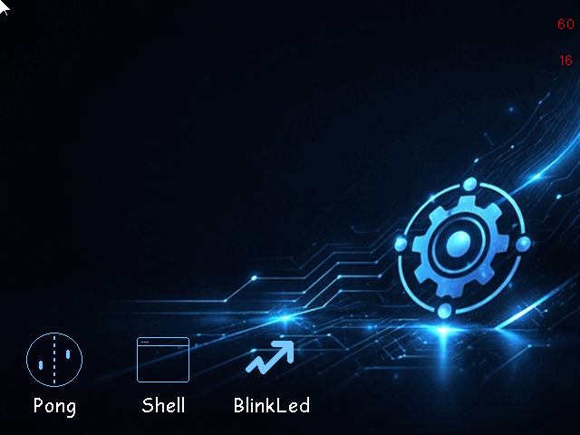
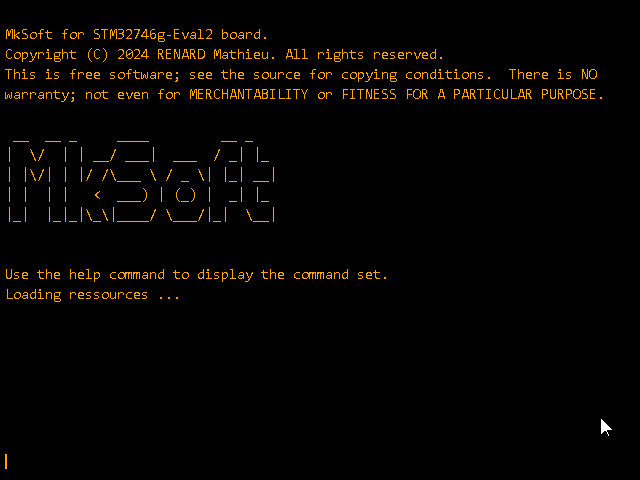
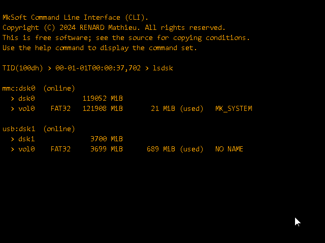
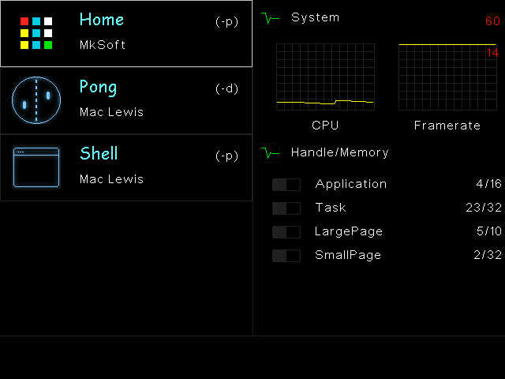
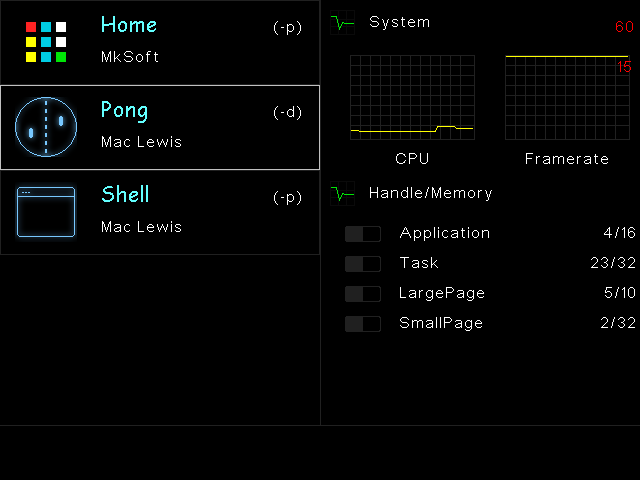
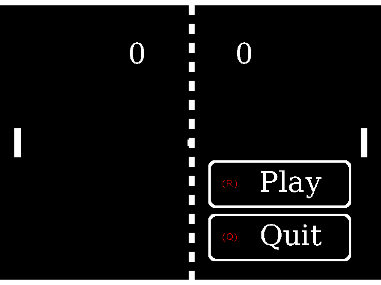

# Mk
     

**Mk** is a bare-metal operating system built from scratch for the **STM32F746G-Eval2** and 
**STM32F746G-DISCO REV.C** boards.
It targets the **STM32F74xxx** and **STM32F75xxx** MCU families and provides a complete software
ecosystem: a preemptive kernel, a dynamic ELF loader, a FAT file system, a multitasking USB stack,
a graphical engine with Unicode support, and an interactive shell — all written in C and ARM
assembly, with no external dependencies.



> ⚠️ This project is under development. Some features and documentation sections are still
> being completed.

## Features

### Kernel
- Preemptive, priority-based multitasking scheduler (fixed-priority, O(1) selection via CLZ)
- Trusted Execution Environment (TEE) using the Cortex-M7 MPU:
  - **Handler mode** (privileged): full access to protected memory and system resources
  - **Thread mode (privileged)**: used by kernel and system tasks — full memory access, unrestricted use of protected instructions (MSR/MRS on BASEPRI, etc.)
  - **Thread mode (unprivileged)**: used by user applications — restricted memory access enforced by the MPU; any violation triggers a fault and terminates the offending task
- Synchronization primitives: mutex (with priority inheritance), semaphore, event flags, mailbox
- Fixed-size memory pools — no variable-size dynamic allocation, eliminating heap fragmentation entirely
- Synchronous and asynchronous callback execution system
- Structured fault handling: HardFault, MemFault, BusFault, UsageFault, stack overflow detection

### Dynamic ELF Loader
Mk can load and execute external `.elf` files at runtime, relocated into 64 KB pages of external
SDRAM. Programs reference Mk's own API symbols directly via `extern` — the full kernel symbol table
is embedded in the firmware at a fixed address — so external applications require no copy of the
kernel API in their own binary. Shared libraries can be added to overcome the 64 KB page limit.

See the [sym2srec](https://github.com/EmbSoft3/Sym2srec/wiki) tool for details on the symbol
embedding mechanism.

### File System
- FAT32 with multi-partition support
- Concurrent access from multiple tasks (per-volume mutex)
- Full API: `open`, `close`, `read`, `write`, `seek`, `tell`, `eof`, `stat`, `rename`, `unlink`,
  `chmod`, `expand`, `truncate`, directory browsing
- Supports SD/MMC cards and USB Mass Storage Class (MSC) devices

### USB Stack
- Multitasking USB host stack built on the STM32F7 OTG peripheral
- Supported device classes: HUB, HID (keyboard, mouse, joystick, gamepad), MSC
- Designed for extensibility — new device classes can be added without modifying the core stack

### Graphical Engine
- Hardware-accelerated 2D rendering via the Cortex-M7 ChromART (DMA2D) unit
- Drawing primitives: rectangles, circles, lines, arcs
- Image rendering: BMP 24-bit and 32-bit
- Full Unicode text rendering: ASCII, UTF-8, UTF-16, UTF-32
- Font manager: native fonts stored in FLASH/QSPI; additional fonts can be loaded at runtime into RAM
- UI object library: buttons, text fields, edit fields, progress bars, 2D graphs, cursors, layers
- Event-driven application model: painting callbacks and input-listening callbacks

### Shell
Built-in interactive shell with support for both native and dynamically loaded commands:

| Command | Description |
|---------|-------------|
| `ls` | List directory contents |
| `cd` | Change current directory |
| `pwd` | Print working directory |
| `lsdsk` | List mounted disks and partitions |
| `launch` | Load and run an external `.elf` application |
| `install` / `uninstall` | Install or remove an application |
| `terminate` | Stop a running application |
| `getapps` | List installed applications |

---

## Architecture

Mk is organized into three layers: Foundation for core hardware and OS services, Subsystems for system services, and System Platform for applications and graphics.:

```
╔═════════════════════════════════════════════════════════════════════╗
║  SYSTEM PLATFORM  (Application)                                     ║
║                                                                     ║
║   ┌─────────────┐             ┌──────────┐              ┌────────┐  ║
║   │  Supervisor │             │   Home   │              │ Shell  │  ║
║   │   (faults)  │             │   screen │              │        │  ║
║   └─────────────┘             └──────────┘              └────────┘  ║
╠═════════════════════════════════════════════════════════════════════╣
║  SUBSYSTEMS                                                         ║
║                                                                     ║
║  ┌────────────┐   ┌──────────────┐   ┌───────────┐   ┌───────────┐  ║
║  │ Dispatcher │   │  ELF Loader  │   │ FAT File  │   │   USB     │  ║
║  │            │   │  + S-Record  │   │  System   │   │   Stack   │  ║
║  │            │   │              │   │           │   |           |  ║
║  │            │   │              │   │           │   |           |  ║
║  └────────────┘   └──────────────┘   └───────────┘   └───────────┘  ║
║                                                                     ║
║  ┌───────────────────────────────────────────────────────────────┐  ║
║  │  Graphical Engine (BSP Engine)                                │  ║
║  │  ChromART · LCD · Containers · Objects · Fonts · Color · Vect │  ║
║  └───────────────────────────────────────────────────────────────┘  ║
╠═════════════════════════════════════════════════════════════════════╣
║  FOUNDATION  (no dependency on anything above)                      ║
║                                                                     ║
║  ┌──────────────────────┐   ┌──────────────┐   ┌────────────────┐   ║
║  │       Kernel         │   │ BSP Drivers  │   │  Binary · Math │   ║
║  │  Scheduler · Mutex   │   │  GPIO · I2C  │   │  Vect 2D · ASM │   ║
║  │  Event · Mail · Pool │   │  USB · MMC   │   │                │   ║
║  │  SVC · TEE · MPU     │   │  QSPI        │   │                │   ║
║  └──────────────────────┘   └──────────────┘   └────────────────┘   ║
║                                                                     ║
║  ┌──────────────────────────────────────────────────────────────┐   ║
║  │  STM32F74xxx Peripherals — NVIC · FPU · DMA · RTC · SDRAM    │   ║
║  └──────────────────────────────────────────────────────────────┘   ║
╚═════════════════════════════════════════════════════════════════════╝
                  STM32F746G — Cortex-M7 @ 216 MHz
```

---

## Build

### Hardware targets

Both boards are supported from the `main` branch. The target is selected at build time via the
CMake preset:

| Preset | Board | MCU |
|--------|-------|-----|
| `release-eval2` / `debug-eval2` | STM32F746G-Eval2 | STM32F746NG |
| `release-disco` / `debug-disco` | STM32F746G-DISCO REV.C | STM32F746NG |

### Requirements

- [GNU Arm Embedded Toolchain 10.3-2021.10](https://developer.arm.com/downloads/-/gnu-rm)
- CMake ≥ 3.25
- Ninja

### Build system

The project uses **CMake** with **presets** defined in `CMakePresets.json`. Four presets are
available:

| Preset | Board | Type |
|--------|-------|------|
| `release-eval2` | STM32F746G-Eval2 | Release (`-Ofast`) |
| `debug-eval2` | STM32F746G-Eval2 | Debug (`-O0 -g3`) |
| `release-disco` | STM32F746G-DISCO REV.C | Release (`-Ofast`) |
| `debug-disco` | STM32F746G-DISCO REV.C | Debug (`-O0 -g3`) |

### Steps

1. Configure the project using the desired preset:
   ```
   cmake --preset debug-eval2
   ```

2. Build the firmware:
   ```
   cmake --build --preset debug-eval2
   ```

   This produces in `build/<preset>/`:
   - `Mk.elf` — full debug symbols
   - `Mk-Strip.elf` — stripped binary
   - `Mk.srec` — S-Record with embedded symbol table
   - `Mk.map` — linker map file

### Compiler versions used

| Tool | Version |
|------|---------|
| `arm-none-eabi-gcc` | 10.3.1 20210824 (GNU Arm Embedded Toolchain 10.3-2021.10) |
| `arm-none-eabi-g++` | 10.3.1 20210824 (GNU Arm Embedded Toolchain 10.3-2021.10) |
| CMake | ≥ 3.25 |
| Ninja | latest |

### Flashing and debugging

Debug configurations for **VS Code** are included in the repository in `.vscode/launch.json`,
using the [Cortex-Debug](https://github.com/Marus/cortex-debug) extension with J-Link:

| Configuration | Board | Type | Binary flashed |
|---|---|---|---|
| `Debug Mk — EVAL2 (J-Link)` | STM32F746G-Eval2 | Debug | `build/debug-eval2/Mk.srec` |
| `Debug Mk — DISCO (J-Link)` | STM32F746G-DISCO REV.C | Debug | `build/debug-disco/Mk.srec` |
| `Release Mk — EVAL2 (J-Link)` | STM32F746G-Eval2 | Release | `build/release-eval2/Mk.srec` |
| `Release Mk — DISCO (J-Link)` | STM32F746G-DISCO REV.C | Release | `build/release-disco/Mk.srec` |

Debug configurations load symbols from `Mk.elf` via GDB. Release configurations flash `Mk.srec`
only — no debug symbols are loaded.

> ⚠️ **It is critical to flash `Mk.srec` and not `Mk.elf`.**
> The [sym2srec](https://github.com/EmbSoft3/Sym2srec/wiki) tool embeds the kernel symbol table
> directly into the S-Record binary at a fixed address (`0x002C0000`). This symbol table is
> required at runtime by the dynamic ELF loader to resolve application symbols against the kernel
> API. Flashing `Mk.elf` instead of `Mk.srec` would produce a firmware without the embedded
> symbol table, causing dynamic loading to fail. Debug symbols are loaded separately from
> `Mk.elf` by GDB and do not need to be flashed.

All configurations require a J-Link probe (or a ST-Link flashed with the J-Link firmware) and
the [J-Link Software](https://www.segger.com/downloads/jlink/) installed.

### SD card setup

Before running Mk for the first time, prepare the SD card as follows:

- Create one or more FAT32 partitions.
- The main partition must be named `MK_SYSTEM`.
- A minimum size of 512 MB per partition is required.
- Supported cluster sizes range from 512 to 65,536 bytes.

Once the card is partitioned and formatted, copy the contents of the
[Storage](https://github.com/EmbSoft3/Mk/tree/main/Mk/Storage) directory onto the `MK_SYSTEM`
partition. This directory contains the file system tree expected by the kernel at runtime (built-in application binaries, configuration files, etc.).

---

### Controls

Connect a **USB 2.0 Hub** to the **USB HS** port, then plug in a **USB Keyboard** and a **USB Mouse** to interact with the OS and the graphical interface.
The table below lists the keyboard and mouse controls available in the **Home** and **Supervisor**
applications. A full description is available in the
[gui.md](https://github.com/EmbSoft3/Mk/edit/main/Mk/Storage/mk/apps/home/gui.md) file.

| Key / Action | Description |
|---|---|
| `PRINTSCREEN` | Saves a screenshot to the file system |
| `F11` | Toggles screenshot streaming on/off |
| `ALT` + `S` | Shows or hides the supervisor console |
| `ALT` + `F` | Displays the framerate and CPU load on the foreground layer |
| `ALT` + `B` | Displays the framerate and CPU load on the background layer |
| `ALT` + `F4` | Closes the running application |
| `LEFTGUI` | Opens the application manager |
| `LEFTGUI` + `UP` | Switches between running applications |
| `LEFTGUI` + `DOWN` | Switches between running applications |
| `LEFTGUI` + `DELETE` | Closes the running application |
| `LEFTGUI` + `TAB` | Moves the focus to the next field |
| `LEFT` | Navigates between installed applications |
| `RIGHT` | Navigates between installed applications |
| `ENTER` | Launches the selected application |
| Mouse scroll | Navigates between installed applications |
| Mouse click | Launches the selected application |

---

## Screenshots

| Boot | Shell |
|------|-------|
|  |  |

| Home screen | File manager |
|-------------|--------------|
|  |  |

| File manager (2) | Pong |
|------------------|------|
|  |  |

---

## Video Demonstration

For a complete overview of the system booting, the shell interaction, and dynamic application loading, watch the full video:

[](https://www.youtube.com/watch?v=cj7DHqhJ5gcO)

---

## Future developments

Given the scope of the project, it was released without all the planned features. The following features will be added in the future:

 - Writing documentation
 - Adding file system access permissions
 - Adding sound support to the graphics engine (USB isochronous transfers)
 - Adding touch event support to the graphics engine
 - Implementing a TCP/IP stack

This list is not exhaustive, and includes only the main features.

---

## License

Copyright © 2024 **Mathieu Renard**. All rights reserved.

This project is licensed under the **BSD 3-Clause License** — see the [LICENSE](LICENSE) file for
details.
